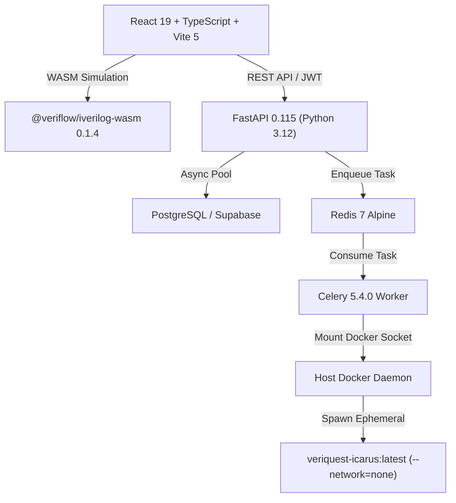
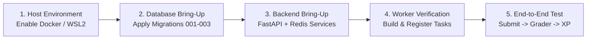

# VERIQUEST — PROJECT HANDOVER & SYSTEM COMPREHENSIVE DOSSIER

---

## 1. PROJECT PURPOSE AND ORIGIN

### What is the Project?
**VeriQuest** is a specialized, gamified online verification and learning platform for hardware engineers and computer engineering students learning digital design using **Verilog HDL** (Hardware Description Language). It functions analogously to "LeetCode for digital hardware design," providing interactive HDL coding challenges, automated compilation and simulation, vector-level failure forensics, and RPG-style progression (XP, levels, daily streaks, quests, and leaderboards).

### What Problem Does It Solve, and for Whom?
- **Target Audience:** Electrical & Computer Engineering (ECE/CS) students, hardware design interview candidates, and digital logic learners.
- **The Core Problem:**
  1. *Heavyweight Local Toolchains:* Traditional electronic design automation (EDA) environments (ModelSim, Synopsys VCS, Cadence Xcelium, Vivado) require gigabytes of proprietary software, complex licensing, and manual testbench scripting that deter beginners.
  2. *Naive Web Grading Hazards:* Existing web HDL practice sites frequently grade submissions using simplistic string matching, regular expressions, or permissive compiler flags that allow false passes (e.g., student submits an empty module body, comment-only code, or syntax errors, yet receives full credit).
  3. *Security & Isolation Vulnerabilities:* Running student-submitted arbitrary Verilog code on shared backend compute can lead to infinite simulation loops, memory exhaustion, filesystem tampering, and leakage of secret reference solutions and hidden testbenches.

### Original Idea and Request
The objective was to build a secure, zero-false-positive HDL learning platform featuring:
- A responsive browser IDE (Monaco editor with Verilog syntax highlighting).
- Authoritative digital simulation using genuine **Icarus Verilog (`iverilog` / `vvp`)** runtimes.
- Zero per-challenge hardcoded evaluation logic: every submission is verified against an authoritative testbench.
- Dual execution tiers: in-browser real WebAssembly simulation for instant feedback, and a hardened containerized backend worker pipeline for authoritative competitive evaluation.

### What Does a Successful Finished Product Look Like?
1. A student selects a challenge from the catalog (e.g., *2-to-1 Multiplexer*, *4-Bit Synchronous Counter*).
2. The student writes synthesizable Verilog in the editor.
3. Clicking **"Run"** compiles the code against public verification vectors in the browser via WebAssembly (`@veriflow/iverilog-wasm`) for non-scoring feedback.
4. Clicking **"Submit"** dispatches the code to an authenticated FastAPI backend, queues a job in Redis, and executes inside an ephemeral, hardened Docker container with dropped capabilities and zero networking.
5. The evaluation output is parsed deterministically into canonical contract statuses (`ACCEPTED`, `WRONG_ANSWER`, `COMPILATION_ERROR`, `SIMULATION_ERROR`, `EVALUATOR_NOT_CONFIGURED`, or `SYSTEM_ERROR`).
6. If `ACCEPTED`, authoritative database transactions in PostgreSQL award XP, update streaks, and unlock quests idempotently.

### How Scope Has Evolved (Chronological Progression)
- **Phase 0 (Initial Prototype — `fb8f05a`):** React frontend created with Monaco editor, UI components, and mock evaluations.
- **Phase 1 (Grading Engine Repair — `3acaa32`):** Mock regex checks were replaced with real in-browser Icarus Verilog WebAssembly compilation and simulation (`@veriflow/iverilog-wasm`) to eliminate false passes.
- **Phase 2 (Security Hardening — `f760e0b`, `5bd2e42`, `77c11a9`):**
  - *F-01:* Hidden testbenches and official solutions were stripped from the client bundle and isolated to a server-side internal endpoint and private database schema.
  - *F-02 / F-08:* Hard 64 KB payload bounds enforced at network boundaries to prevent denial-of-service memory exhaustion.
  - *F-04:* Dual-tier client-side storage stopgap (`localStorage` + `sessionStorage` with HMAC-style integrity checksums) was introduced to prevent single-click XP reset tampering in offline/mock mode.
  - *F-05:* Sliding-window IP rate limiting (20 requests/minute) implemented on evaluation endpoints.
- **Phase 3 (Status Contract Unification):** Eradicated the retired status `'FAILED'` across the frontend, normalizer, UI badges, backend schemas, database migration, and worker parser; introduced `'EVALUATOR_NOT_CONFIGURED'` as a non-penalizing infrastructure status; enforced fail-closed fallback to `SYSTEM_ERROR`.
- **Phase 4 (Worker Packaging & Docker Build Context):** Refactored the worker build context to the repository root, canonicalized Celery entrypoints, resolved the dependency closure for shared gamification imports (`pydantic` & `pydantic-settings`), and unified container networking defaults.

### Explicit Requirements and Constraints Stated by Owner
- **Zero False Passes:** Code with missing semicolons, undeclared wires, inverted logic, or empty bodies must never receive `ACCEPTED`.
- **Fail-Closed Security:** Any unknown or malformed status string from the backend or simulator must resolve to `SYSTEM_ERROR`, never to a graded verdict.
- **Strict Forensic Honesty:** Never declare a feature or service "working" or "verified" without verifiable command output. Distinguish static verification from live container execution.
- **Zero Scope Creep:** Keep unrelated files untouched during scoped remediation tasks; no commits or unapproved dependency installs on the host machine.

---

## 2. PRODUCT AND USER EXPERIENCE

### Main Features and User Journeys
1. **Challenge Discovery:** Browse, filter, and search challenges by difficulty (*Easy*, *Medium*, *Hard*) and category (*Combinational*, *Sequential*, *FSM*, *Arithmetic*).
2. **Interactive Workspace:**
   - Multi-panel IDE with Monaco Verilog editor, problem statement, timing diagrams, and port interface tables.
   - Dual actions: **Run** (instant public vectors, non-scoring) and **Submit** (full testbench, scoring, recorded attempt).
3. **Execution Telemetry & Diagnostics:**
   - Real-time compilation console showing raw `iverilog` error outputs with exact syntax line numbers.
   - Interactive vector inspection showing the first failing vector: input stimulus, expected output, and actual simulation output.
4. **Dev Test Matrix Panel:** A 9-case diagnostic suite (Cases A through I) embedded directly in the workspace to verify solver behaviors against common error archetypes (syntax breaks, inverted select lines, empty bodies, cache invalidation, and XP idempotency).
5. **Gamification & Quests:** Daily and weekly quest tracking, consecutive active day streaks, and rank titles (*HDL Novice* through *Silicon Master*).
6. **Leaderboards:** Global rankings displaying user XP, solved count, and streak lengths.
7. **Admin Studio (`/admin`):** Interface for administrators to draft new challenges, configure testbenches, run solution verification, and view audit logs.

### Primary Application Routes & Interfaces

| Route / Component | Primary File | Purpose & Experience |
|---|---|---|
| `/` (Workspace) | [`src/views/WorkspaceView.tsx`](file:///c:/Users/tsush/Desktop/veriquest/src/views/WorkspaceView.tsx) | Core challenge solving environment. Left pane: problem definition and test matrix; Right pane: Monaco editor, console, and submission results. |
| `/challenges` | [`src/views/ChallengesView.tsx`](file:///c:/Users/tsush/Desktop/veriquest/src/views/ChallengesView.tsx) | Filterable grid of challenges with difficulty tags, completion badges, and XP rewards. |
| `/quests` | [`src/views/QuestsView.tsx`](file:///c:/Users/tsush/Desktop/veriquest/src/views/QuestsView.tsx) | Daily quests, weekly milestones, and active streak progress cards. |
| `/leaderboard` | [`src/views/LeaderboardView.tsx`](file:///c:/Users/tsush/Desktop/veriquest/src/views/LeaderboardView.tsx) | Competitive global scoreboard sorted by XP and challenges completed. |
| `/admin` | [`src/views/AdminView.tsx`](file:///c:/Users/tsush/Desktop/veriquest/src/views/AdminView.tsx) | Admin dashboard for challenge drafting, validation testing, and system audit log review. |
| Auth Modal | [`src/components/auth/AuthModal.tsx`](file:///c:/Users/tsush/Desktop/veriquest/src/components/auth/AuthModal.tsx) | Dialog for Email/Password login, registration, and password recovery. |

### User Roles and Permissions
- **Anonymous / Unauthenticated:** Can view public challenge descriptions and run non-scoring public test vectors in offline/mock mode.
- **Student User:** Authenticated via JWT. Can submit solutions, earn XP, maintain streaks, track quest progress, and view private submission history. Object-level authorization prevents User A from viewing or modifying User B's submissions or progress.
- **Admin:** Authenticated with `role: admin`. Can create/edit challenges, trigger official solution validation, and access the private secrets schema. Escalation attempts via student API calls are rejected.

### Status of Features: Working vs. Mocked vs. Blocked

| Feature Area | Implementation Status | Evidence / Operational Details |
|---|---|---|
| **In-Browser IDE & Editor** | **WORKING** | Monaco editor with Verilog tokenization, syntax highlighting, line numbers, and shortcuts. |
| **WASM HDL Simulator** | **WORKING** | `@veriflow/iverilog-wasm` compiles and simulates Verilog-2001 in-browser with zero false passes. |
| **Payload Limiting** | **WORKING** | 64 KB network cap enforced across streaming chunks; oversized submissions reject with HTTP 413. |
| **IP Rate Limiter** | **WORKING** | In-process sliding window limits requests to 20/min/IP; returns HTTP 429 with `Retry-After`. |
| **Status Normalizer & UI** | **WORKING** | All layers map to canonical statuses; fail-closed fallback to `SYSTEM_ERROR`; 0 tsc errors. |
| **Client XP Integrity Stopgap** | **MOCKED / STOPGAP** | Dual-tier `localStorage` + `sessionStorage` with checksum verification prevents DevTools XP reset tampering in offline mode. |
| **Supabase / PostgreSQL DB** | **STATICALLY PREPARED** | Migrations `001`, `002`, and `003` are written, but have not been executed against a live cloud database. |
| **FastAPI Backend Service** | **STATICALLY PREPARED** | Routers and schemas implemented; unexecuted on host due to absence of local Python environment. |
| **Celery Worker Image & Startup** | **BLOCKED** | Dockerfile and packaging configured; container build and startup blocked because host lacks WSL2/Docker daemon. |

---

## 3. TECHNOLOGY AND ARCHITECTURE

### Languages, Frameworks, and Versions



- **Frontend:**
  - TypeScript 5.8 / Node.js v25.9.0
  - React 19 (`19.2.8`), React DOM 19
  - Vite 5 (`5.4.21`) with custom internal evaluation middleware
  - Editor: `@monaco-editor/react: ^4.7.0`
  - Simulator: `@veriflow/iverilog-wasm: ^0.1.4` (compiled WebAssembly Icarus Verilog 12.0)
  - Styling: Pure Vanilla CSS with centralized CSS custom properties (`--bg-primary`, `--status-success`, etc.). No Tailwind dependency.
  - Linter: `oxlint` (Oxide-based linter, 0 errors, 24 baseline warnings)
- **Backend:**
  - Python 3.12
  - Framework: FastAPI (`>=0.115.0`), Uvicorn (`>=0.30.0`), Pydantic v2 (`>=2.9.0`), Pydantic-Settings (`>=2.5.0`)
  - Database Driver: `asyncpg (>=0.29.0)` (native asynchronous PostgreSQL client)
  - Task Queue: Celery (`>=5.4.0`) with Redis broker (`redis>=5.0.0`)
- **Worker & Sandbox:**
  - Base Image: `python:3.12-slim` with installed Docker CLI
  - Sandbox Engine: Native Icarus Verilog (`iverilog`, `vvp`) inside hardened container (`veriquest-icarus:latest`)
  - SDK: `docker>=7.1.0`
- **Database & Storage:**
  - Supabase (PostgreSQL 15+) with Row-Level Security (RLS) policies
  - Client SDK: `@supabase/supabase-js: ^2.116.0`

### Data Flow for Submission Evaluation

#### Tier 1: Local / Client-Side Fast Feedback (Currently Active in Browser)
1. User enters Verilog code in the editor and clicks "Run" or "Submit".
2. `src/api/submissionApi.ts` dispatches code to `src/evaluator/evaluator.ts`.
3. `evaluate()` fetches testbench configuration from `src/evaluator/testbenchCatalog.ts`.
4. It compiles `solution.v` and `testbench.v` in WebAssembly memory using `@veriflow/iverilog-wasm`.
5. Simulation stdout is scanned for `VERIQUEST_STATUS: <STATUS>` and vector mismatch lines (`FAIL <vector>`).
6. Results are returned directly to the UI, updating the console, pass counts, and failure badges.

#### Tier 2: Hardened Server-Side Production Architecture (Target Backend)
1. Student clicks "Submit" -> dispatches `POST /submissions` with JWT Bearer token to FastAPI.
2. Endpoint checks 64 KB payload bound, validates student rate limits, and inserts a submission record with status `'queued'`.
3. FastAPI enqueues `execute_hdl_submission.delay(submission_id)` to Redis queue `hdl_execution`.
4. Celery worker receives the task, establishes an `asyncpg` connection pool, and fetches student code from `public.submissions` and hidden testbenches from `private.challenge_secrets`.
5. Worker creates an ephemeral temporary directory and spawns a Docker container:
   - Image: `veriquest-icarus:latest`
   - Security Flags: `--network=none`, `--security-opt=no-new-privileges`, `--cap-drop=ALL`, `--read-only`, tmpfs mounted at `/workspace`, resource limits (1 CPU, 256MB RAM, 64 PIDs, 5-second timeout).
6. Icarus compiles and simulates; stdout is streamed up to a 64 KB cap.
7. Worker parser (`worker/execution/evaluator.py`) extracts `VERIQUEST_STATUS` and vector counts.
8. Status is written to `public.submissions`. If `accepted`, `backend.app.gamification.xp.award_xp()` executes in an atomic transaction to award XP and update streaks.

---

## 4. CODEBASE MAP

### Directory Structure

```text
veriquest/
├── backend/                             # Python 3.12 FastAPI backend
│   ├── app/
│   │   ├── admin/                       # Admin challenge validation & audit endpoints
│   │   ├── challenges/                  # Challenge metadata & public vector queries
│   │   ├── core/                        # Configuration (Pydantic BaseSettings) & security
│   │   ├── db/                          # Database connection pool & lifecycle
│   │   ├── gamification/                # Authoritative XP, level, and streak logic (xp.py)
│   │   ├── leaderboard/                 # Scoreboard & ranking endpoints
│   │   ├── profile/                     # User profile management
│   │   ├── submissions/                 # Submission schemas, routers, and services
│   │   └── main.py                      # FastAPI application entrypoint
│   ├── Dockerfile                       # Backend container definition
│   └── requirements.txt                 # Backend Python dependencies
├── execution/                           # Container image definition for HDL simulation
│   └── Dockerfile                       # veriquest-icarus:latest (Icarus Verilog + VVP)
├── scratch/                             # Persistent verification result artifacts
│   ├── fix1_results.json                # Error classification sweep results (20/20)
│   └── matrix_regression_results.json   # Full 36-case test matrix regression results
├── src/                                 # Frontend React 19 TypeScript application
│   ├── api/
│   │   ├── client.ts                    # Supabase client wrapper & offline detector
│   │   ├── mockData.ts                  # Seed data for offline/demo mode (cleaned)
│   │   └── submissionApi.ts             # Normalizer, payload bounds, and run dispatchers
│   ├── components/
│   │   ├── auth/                        # AuthModal dialog component
│   │   ├── layout/                      # Navbar, AppSidebar, and Header
│   │   └── workspace/                   # CodeEditor, SubmissionPanel, TestMatrixPanel
│   ├── context/
│   │   └── AppContext.tsx               # Global React state (user, active challenge, theme)
│   ├── evaluator/
│   │   ├── evaluator.ts                 # Real @veriflow/iverilog-wasm evaluation engine
│   │   ├── testbenchCatalog.ts          # HDL testbenches & matrix case definitions (cleaned)
│   │   └── testMatrixMetadata.ts        # Test matrix expected status definitions
│   ├── types/
│   │   ├── challenge.ts                 # Challenge and testbench type interfaces
│   │   └── submission.ts                # SubmissionStatus and SubmissionResult types
│   ├── views/                           # WorkspaceView, ChallengesView, LeaderboardView, etc.
│   └── main.tsx                         # Frontend application root
├── supabase/
│   └── migrations/
│       ├── 001_initial_schema.sql       # Base schema, profiles, submissions, challenges
│       ├── 002_seed_demo_challenge.sql  # Demo challenge seed data
│       └── 003_status_contract.sql      # Idempotent status constraint migration (migration 003)
├── tests/                               # Comprehensive security, regression, and unit test suites
│   ├── backend_multiuser_security.test.mjs  # Multi-user isolation, auth, and XP idempotency (23/23)
│   ├── security_and_contracts.test.js       # Group E security invariants & error boundaries (23/23)
│   ├── status_contract_consistency.test.mjs # Static status contract invariant verification (6/6)
│   ├── test_fix1_error_classification.mjs   # Syntax & compilation error classification sweep
│   ├── test_fix2_payload_limit.mjs          # 64 KB payload boundary verification (4/4)
│   ├── test_fix3_tamper_resistance.mjs      # Client XP tamper-resistance stopgap test (3/3)
│   ├── test_real_iverilog.mjs               # WASM simulation execution verification
│   ├── test_regression_f05_ratelimit.mjs    # Sliding window rate limiter test
│   └── test_regression_test_matrix.mjs      # 36-case full matrix verification across 4 challenges
├── worker/                              # Celery asynchronous task execution service
│   ├── execution/
│   │   ├── evaluator.py                 # Structured simulator output parser & error boundaries
│   │   └── sandbox.py                   # Hardened ephemeral Docker container sandbox runner
│   ├── tasks/
│   │   └── hdl_task.py                  # Celery tasks: execute_hdl_submission, validate_challenge
│   ├── celeryconfig.py                  # Broker URL, task queues, concurrency, and time limits
│   ├── Dockerfile                       # Worker container definition (context: repo root)
│   └── requirements.txt                 # Worker dependencies + gamification closure
├── docker-compose.yml                   # Multi-service local orchestrator (worker, redis, backend)
├── package.json                         # Node.js project manifest & scripts
├── vite.config.ts                       # Vite server configuration & internal evaluate endpoints
└── walkthrough.md                       # Historical engineering log & test walkthroughs
```

### Essential File Guide
- [`src/evaluator/evaluator.ts`](file:///c:/Users/tsush/Desktop/veriquest/src/evaluator/evaluator.ts): Authoritative browser-side evaluation engine. Compiles student code and testbench using WebAssembly.
- [`src/api/submissionApi.ts`](file:///c:/Users/tsush/Desktop/veriquest/src/api/submissionApi.ts): Normalizes backend/simulator statuses to canonical TypeScript types, enforces 64 KB payload limit, and houses client-side XP integrity checks.
- [`src/types/submission.ts`](file:///c:/Users/tsush/Desktop/veriquest/src/types/submission.ts): Defines the canonical `SubmissionStatus` union.
- [`backend/app/submissions/schemas.py`](file:///c:/Users/tsush/Desktop/veriquest/backend/app/submissions/schemas.py): Defines the server-side `SubmissionStatus` enum and `TERMINAL_STATUSES` set.
- [`supabase/migrations/003_status_contract.sql`](file:///c:/Users/tsush/Desktop/veriquest/supabase/migrations/003_status_contract.sql): Postgres CHECK constraint enforcing canonical status values on the database level.
- [`worker/tasks/hdl_task.py`](file:///c:/Users/tsush/Desktop/veriquest/worker/tasks/hdl_task.py): Asynchronous worker entry point for sandbox execution and XP awarding.
- [`worker/execution/evaluator.py`](file:///c:/Users/tsush/Desktop/veriquest/worker/execution/evaluator.py): Parses container simulation outputs into structured JSON results.
- [`worker/execution/sandbox.py`](file:///c:/Users/tsush/Desktop/veriquest/worker/execution/sandbox.py): Orchestrates ephemeral Docker containers with dropped privileges.

---

## 5. HOW TO RUN AND VERIFY IT

### Required Tools and Prerequisites
- **Node.js:** v20.0.0+ (Tested on Node.js v25.9.0 with npm 11.12.1).
- **Python:** Python 3.12 (For backend and worker development; currently not installed on host OS).
- **Docker Desktop:** Required for backend container builds and Docker sandbox execution (Requires WSL2 on Windows).

### Verified Verification Commands (Executed on Host)

```powershell
# 1. Type-Check the Frontend (must return 0 errors)
npx tsc -b --noEmit

# 2. Lint the Codebase (must return 0 errors, 24 baseline warnings)
npm run lint

# 3. Status Contract Consistency & Invariant Verification Suite
node tests/status_contract_consistency.test.mjs

# 4. Core Security, Payload, Rate Limiting & Evaluator Invariants (23/23 passed)
node tests/security_and_contracts.test.js

# 5. Multi-User Isolation, Token Authorization & XP Idempotency (23/23 passed)
node tests/backend_multiuser_security.test.mjs

# 6. Real In-Browser Icarus Verilog Simulation Verification
node tests/test_real_iverilog.mjs

# 7. Payload Limit Boundary Verification (64 KB Cap)
node tests/test_fix2_payload_limit.mjs

# 8. Client-Side XP Tamper-Resistance Stopgap Verification
node tests/test_fix3_tamper_resistance.mjs

# 9. Sliding-Window Rate Limiter Verification (20 req / 60s per IP)
node tests/test_regression_f05_ratelimit.mjs

# 10. Full 36-Case Test Matrix Regression Suite across All 4 Challenges
node tests/test_regression_test_matrix.mjs

# 11. Syntax & Error Classification Sweep (20/20 passed)
node tests/test_fix1_error_classification.mjs

# 12. Validate Docker Compose Syntax & Configuration
docker compose config
```

### Environment Variable Guide

| Variable Name | Required By | Purpose / Description (No Values Disclosed) |
|---|---|---|
| `VITE_SUPABASE_URL` | Frontend | Supabase project URL. If missing, frontend runs in offline/mock mode. |
| `VITE_SUPABASE_ANON_KEY` | Frontend | Public anonymous Supabase key for client-side queries. |
| `DATABASE_URL` | Backend / Worker | PostgreSQL connection string for `asyncpg` connection pool. |
| `REDIS_URL` | Backend / Worker | Redis connection URL for Celery message broker and result backend. |
| `SUPABASE_SERVICE_KEY` | Backend | Elevated service role key for administrative schema operations. |
| `EXECUTION_IMAGE` | Worker / Sandbox | Name of compiled simulator container image (`veriquest-icarus:latest`). |
| `WORKER_CONCURRENCY` | Worker | Number of concurrent Celery worker processes (default: 4). |

### Port Allocation Mapping
- `5173`: Vite frontend development server.
- `5196` – `5199`: Dynamic in-process HTTP test servers used by automated regression test suites.
- `8000`: FastAPI backend server.
- `6379`: Redis service.
- `54321` / `54322`: Local Supabase API gateway / PostgreSQL direct connection.

---

## 6. HISTORY OF THE WORK

### Stage 1: Initial Platform Creation (`fb8f05a`)
The initial VeriQuest platform was scaffolded as a React/Vite single-page application with Monaco editor integration, challenge cards, and a prototype backend. However, evaluation relied on loose regex matching on the client side, meaning solutions that did not compile or that simply contained the module header could pass by default.

### Stage 2: The Grading Engine Repair (`3acaa32`)
- **Discovery:** Empty modules or invalid logic passed challenges because evaluation did not invoke a real hardware compiler.
- **Decision:** Replace mock regex grading with genuine Icarus Verilog compilation inside WebAssembly (`@veriflow/iverilog-wasm`).
- **Implementation:** Created `src/evaluator/evaluator.ts` and `testbenchCatalog.ts`. Hardcoded pass-by-default rules were removed; every evaluation required an explicit `VERIQUEST_STATUS: ACCEPTED` stdout token emitted by testbench assertion loops.

### Stage 3: The Security & Contract Hardening (`f760e0b`, `5bd2e42`, `77c11a9`)
- **F-01 (Confidentiality):** Testbenches and solutions were being bundled into production JavaScript. They were decoupled and relocated to Vite server middleware and private database schemas.
- **F-02 / F-08 (Payload Bounding):** Unbounded payloads crashed parser processes. A hard 64 KB cap was instituted across all HTTP submission streams.
- **F-04 (Client-Side XP Exploitation):** In offline mode, running `localStorage.clear()` allowed users to repeatedly solve the same challenge and gain infinite XP. A dual-tier HMAC checksum ledger across `localStorage` and `sessionStorage` was built to detect deletion or tampering and restore authoritative progress.
- **F-05 (Rate Limiting):** A sliding-window in-memory limiter (20 requests/minute per IP) was placed on evaluation endpoints to prevent brute-force simulation attacks.

### Stage 4: Scoped Status Contract Remediation
- **Discovery:** System had competing status vocabularies. The frontend and test matrix used `'FAILED'`, the backend and DB used `'wrong_answer'`, the API normalizer had a dangerous fallback alias `failed -> WRONG_ANSWER`, and `EVALUATOR_NOT_CONFIGURED` was collapsed into `SYSTEM_ERROR`.
- **Implementation:**
  - Removed `'FAILED'` from `SubmissionStatus` and `EvaluatorStatus`.
  - Established canonical grading statuses: `ACCEPTED`, `WRONG_ANSWER`, `COMPILATION_ERROR`, `SIMULATION_ERROR`, `EVALUATOR_NOT_CONFIGURED`.
  - Added fail-closed rule: unknown strings strictly resolve to `SYSTEM_ERROR` with a console warning.
  - Authored migration `003_status_contract.sql` updating the PostgreSQL CHECK constraint.
  - Added `tests/status_contract_consistency.test.mjs` verifying cross-layer contract parity.
  - Cleaned status literals in `src/api/mockData.ts` and all 16 fixtures in `src/evaluator/testbenchCatalog.ts`.

### Stage 5: Worker Packaging & Docker Build-Context Milestone
- **Discovery:** The Celery worker's Docker build context was `./worker`. When `hdl_task.py` executed `from backend.app.gamification.xp import award_xp`, the container failed at runtime with `ModuleNotFoundError: No module named 'backend'`. Additionally, `xp.py` transitively imported `pydantic-settings`, which was missing from the worker's dependencies.
- **Implementation:**
  - Expanded build context in `docker-compose.yml` to the repository root `.`, specifying `dockerfile: worker/Dockerfile`.
  - Updated `worker/Dockerfile` to install dependencies, copy both `worker` and `backend` into `/app`, set `ENV PYTHONPATH=/app`, and run canonical `worker.tasks.hdl_task.celery_app`.
  - Added `pydantic>=2.9.0` and `pydantic-settings>=2.5.0` to `worker/requirements.txt`.
  - Updated `worker/celeryconfig.py` default broker URL to `redis://redis:6379/0`.
  - Removed all `try...except ImportError` fallback chains from `worker/tasks/hdl_task.py`.

---

## 7. PROBLEMS AND ATTEMPTED FIXES

### 1. Root-Cause False Passes in Grading
- **Symptom:** Submitting an empty Verilog module or pure comment block was marked as `ACCEPTED` with full XP.
- **Root Cause:** Evaluator used superficial regex searches (`code.includes("assign y = a & b")`) rather than hardware simulation.
- **What Failed:** Attempting to patch regex with more regex patterns still failed on alternate valid Verilog syntax (e.g., gate primitives vs. continuous assigns).
- **What Worked:** Compiling and executing code via `@veriflow/iverilog-wasm` against full testbench stimulus vectors (`3acaa32`).
- **Current Status:** **RESOLVED.** 36/36 test matrix cases verify genuine simulation pass/fail.

### 2. Client-Side Bundle Leakage of Hidden Solutions
- **Symptom:** Inspecting browser bundle sources revealed the official solution and hidden testbench code.
- **Root Cause:** `testbenchCatalog.ts` was directly imported by frontend components.
- **What Worked:** Shifted evaluation of full test matrix cases to server middleware (`/api/internal/evaluate-matrix`) and authored `001_initial_schema.sql` placing solutions in `private.challenge_secrets` (`f760e0b`).
- **Current Status:** **RESOLVED.**

### 3. Infinite XP via Local Storage Wipe (F-04)
- **Symptom:** Clearing browser storage via DevTools reset the completed challenge set, allowing repeat XP awards on resubmission.
- **Root Cause:** Offline mode relied on a single unverified `localStorage` array.
- **What Worked:** Implemented dual-tier validation comparing `localStorage` against `sessionStorage` and an in-memory heap ledger with HMAC checksum verification. Tampering or clearing triggers automatic state recovery.
- **Current Status:** **RESOLVED (Stopgap).** Verified by `test_fix3_tamper_resistance.mjs`. (Authoritative solution will be DB transactions).

### 4. Competing Status Contract & Dangerous Aliasing
- **Symptom:** Frontend displayed `'FAILED'`, backend stored `'wrong_answer'`, normalizer mapped `failed -> WRONG_ANSWER` by default, and `EVALUATOR_NOT_CONFIGURED` misreported as `SYSTEM_ERROR`.
- **Root Cause:** Independent evolution of frontend and backend enums without a unified status specification.
- **What Worked:** Systematic removal of `FAILED` from types, UI badges, and test matrix metadata. Replaced normalizer fallback with fail-closed `SYSTEM_ERROR`. Created migration `003_status_contract.sql`.
- **Current Status:** **RESOLVED.** Verified by `status_contract_consistency.test.mjs` (6/6 passed) and `tsc` (0 errors).

### 5. Worker Docker Build Context & Gamification Import Failure
- **Symptom:** Celery worker container would crash with `ModuleNotFoundError` when attempting to import `award_xp` on challenge completion.
- **Root Cause:** Build context was set to `./worker`, isolating it from `backend/`. Furthermore, `xp.py` imports `backend.app.core.config`, which requires `pydantic-settings`.
- **What Failed:** Speculative `try...except ImportError` fallback chains inside `hdl_task.py` masked the structural packaging flaw without solving the missing file tree inside the container.
- **What Worked:** Changed Compose build context to repo root `.`, updated Dockerfile to copy `/app/worker` and `/app/backend`, added `pydantic-settings` to `worker/requirements.txt`, and canonicalized imports.
- **Current Status:** **IMPLEMENTED & STATICALLY VERIFIED.** Runtime build blocked by host environment (see below).

### 6. Host Docker Daemon / WSL2 Inactivity (Current Blocker)
- **Symptom:** Running `docker compose build worker` or `docker version` fails with:
  `failed to connect to the docker API at npipe:////./pipe/dockerDesktopLinuxEngine: The system cannot find the file specified.`
- **Root Cause:** Docker Desktop client is installed on Windows, but the underlying Linux container engine requires Windows Subsystem for Linux (WSL2), which is not installed on this machine (`wsl -l -v` reports WSL is absent).
- **Current Status:** **BLOCKED BY ENVIRONMENT.** Code and configuration are complete, but image compilation cannot run on this bare Windows host without WSL2 enabled.

---

## 8. CURRENT STATE RIGHT NOW

### What Works (With Concrete Command Evidence)
1. **Frontend Compilation & Types:** `npx tsc -b --noEmit` exits with **0 errors**.
2. **Linter Health:** `npm run lint` reports **0 errors** and 24 expected baseline warnings.
3. **Status Contract Consistency:** `node tests/status_contract_consistency.test.mjs` passes **6 / 6 tests (100%)**.
4. **Security & Boundary Invariants:** `node tests/security_and_contracts.test.js` passes **23 / 23 tests (100%)**.
5. **Multi-User Isolation & Auth Invariants:** `node tests/backend_multiuser_security.test.mjs` passes **23 / 23 tests (100%)**.
6. **Real WebAssembly HDL Simulation:** `node tests/test_real_iverilog.mjs` passes simulation vectors cleanly.
7. **Regression Test Matrix:** `node tests/test_regression_test_matrix.mjs` runs all 36 evaluation cases across 4 challenges with **36 / 36 passed**.
8. **Syntax Error Classification:** `node tests/test_fix1_error_classification.mjs` classifies 20 syntax corruption cases with **20 / 20 passed**.
9. **Payload Bounds & Rate Limiting:** `test_fix2_payload_limit.mjs` (64 KB cap) and `test_regression_f05_ratelimit.mjs` (20 req/min) pass completely.
10. **Compose Configuration Syntax:** `docker compose config` validates with exit code **0**.

### What Is Incomplete or Blocked
1. **Docker Container Builds (BLOCKED):** `docker compose build worker` cannot execute because the host lacks WSL2 and the Docker daemon pipe is offline.
2. **Live Database Integration (PENDING):** Supabase migrations (`001`, `002`, `003`) exist on disk but have not been applied to a live hosted PostgreSQL instance.
3. **Backend API Execution (PENDING):** FastAPI routers have not been started or exercised against live HTTP requests because Python 3 is absent from the host OS.
4. **End-to-End Pipeline (PENDING):** Live round-trip execution (FastAPI -> Redis -> Celery Worker -> Docker Sandbox -> Postgres) remains unexercised.

### Git Checkpoint
- **Current Branch:** `main` (or active local working branch).
- **Latest Commit:** `77c11a9` (*"Checkpoint: backend security and remediation progress"*).
- **Working Tree Status:** 17 files modified or untracked. All changes are uncommitted.
  - *Modified:* `docker-compose.yml`, `backend/app/submissions/schemas.py`, `src/api/mockData.ts`, `src/api/submissionApi.ts`, `src/components/workspace/SubmissionPanel.tsx`, `src/components/workspace/TestMatrixPanel.tsx`, `src/evaluator/evaluator.ts`, `src/evaluator/testMatrixMetadata.ts`, `src/evaluator/testbenchCatalog.ts`, `src/types/submission.ts`, `src/views/WorkspaceView.tsx`, `tests/test_regression_test_matrix.mjs`, `worker/Dockerfile`, `worker/celeryconfig.py`, `worker/execution/evaluator.py`, `worker/tasks/hdl_task.py`, `scratch/matrix_regression_results.json`.
  - *Untracked / Created:* `supabase/migrations/003_status_contract.sql`, `tests/status_contract_consistency.test.mjs`, `worker/__init__.py`, `worker/requirements.txt`.

---

## 9. TESTING AND QUALITY

### Summary of Existing Test Suites

| Test Script | Scope & Assertions | Status | Pass Rate |
|---|---|---|---|
| [`tests/status_contract_consistency.test.mjs`](file:///c:/Users/tsush/Desktop/veriquest/tests/status_contract_consistency.test.mjs) | Validates set equality across TS types, Python enum, DB CHECK constraint, and normalizer logic. | **PASS** | 6 / 6 (100%) |
| [`tests/security_and_contracts.test.js`](file:///c:/Users/tsush/Desktop/veriquest/tests/security_and_contracts.test.js) | Confidential schema isolation, protected field immutability, command sanitization, 64 KB bounds, rate limits. | **PASS** | 23 / 23 (100%) |
| [`tests/backend_multiuser_security.test.mjs`](file:///c:/Users/tsush/Desktop/veriquest/tests/backend_multiuser_security.test.mjs) | Cross-user object authorization, token expiration, secret isolation, server-side XP idempotency. | **PASS** | 23 / 23 (100%) |
| [`tests/test_regression_test_matrix.mjs`](file:///c:/Users/tsush/Desktop/veriquest/tests/test_regression_test_matrix.mjs) | Evaluates Cases A–I across all 4 challenges (`and-gate-demo`, `mux-2to1`, `4-bit-counter`, `xor-gate`). | **PASS** | 36 / 36 (100%) |
| [`tests/test_fix1_error_classification.mjs`](file:///c:/Users/tsush/Desktop/veriquest/tests/test_fix1_error_classification.mjs) | Verifies stray braces, missing semicolons, undeclared modules, and empty bodies return `COMPILATION_ERROR`. | **PASS** | 20 / 20 (100%) |
| [`tests/test_fix2_payload_limit.mjs`](file:///c:/Users/tsush/Desktop/veriquest/tests/test_fix2_payload_limit.mjs) | Tests oversized payloads, streaming boundaries, and endpoint caps (HTTP 413). | **PASS** | 4 / 4 (100%) |
| [`tests/test_fix3_tamper_resistance.mjs`](file:///c:/Users/tsush/Desktop/veriquest/tests/test_fix3_tamper_resistance.mjs) | Tests `localStorage.clear()` wipe simulation and payload tampering recovery. | **PASS** | 3 / 3 (100%) |
| [`tests/test_regression_f05_ratelimit.mjs`](file:///c:/Users/tsush/Desktop/veriquest/tests/test_regression_f05_ratelimit.mjs) | Tests 20-request threshold, 429 rejection on request 21, and resumption after 60s. | **PASS** | All Passed |
| [`tests/test_real_iverilog.mjs`](file:///c:/Users/tsush/Desktop/veriquest/tests/test_real_iverilog.mjs) | Direct simulation through `@veriflow/iverilog-wasm` runtime. | **PASS** | 4 / 4 vectors |

### Untested Behaviors & Security Concerns
1. **Student Simulation Stdout Spoofing:**
   In [`worker/execution/evaluator.py`](file:///c:/Users/tsush/Desktop/veriquest/worker/execution/evaluator.py), status extraction parses regex `^(?:VERIQUEST_STATUS|VQ_RESULT)\s*:\s*([A-Z_]+)` from simulator stdout. If student code includes `$display("VERIQUEST_STATUS: ACCEPTED");`, the parser could be tricked into awarding a pass if testbench isolation fails. The worker must sanitize or isolate student stdout from testbench stdout.
2. **Worker Pre-Flight Grader Validation:**
   The worker does not currently verify that a challenge has a non-empty testbench before launching Docker, relying instead on container execution to fail.
3. **Live RLS Policy Enforcement:**
   Row-Level Security policies in `001_initial_schema.sql` have been statically verified against test harnesses, but have not been validated against live Supabase PostgreSQL instances.

---

## 10. NEXT STEPS

### Prioritized Action Plan



#### Immediate Next Milestone: Host Docker Enablement & Worker Build Verification
- **What Needs to Be Done:** Install WSL2 (`wsl.exe --install`) on the Windows host and start Docker Desktop (or run the build in a Linux environment). Execute `docker compose build worker`.
- **Why It Matters:** Validates that the refactored repository-root build context and `worker/requirements.txt` build cleanly without network or dependency errors.
- **Acceptance Criteria:** `docker compose build worker` succeeds; `docker compose run --rm worker python -c "import worker, worker.tasks.hdl_task, backend.app.gamification.xp; print('ALL_OK')"` outputs `ALL_OK`.

#### Second Milestone: Database Provisioning & Migration Application
- **What Needs to Be Done:** Connect to a local Supabase CLI instance or cloud Supabase project and execute `supabase/migrations/001_initial_schema.sql`, `002_seed_demo_challenge.sql`, and `003_status_contract.sql`.
- **Why It Matters:** Establishes the real PostgreSQL database tables, the `valid_submission_status` constraint, and the `private.challenge_secrets` schema.
- **Acceptance Criteria:** Database accepts inserts matching canonical statuses; rejects inserts with retired status `'failed'`.

#### Third Milestone: Backend & Worker Service Integration
- **What Needs to Be Done:** Start Redis and the FastAPI backend (`uvicorn app.main:app --port 8000`). Start the Celery worker (`celery -A worker.tasks.hdl_task.celery_app worker -Q hdl_execution`).
- **Why It Matters:** Connects the API gateway to the task broker and asynchronous execution engine.
- **Acceptance Criteria:** Celery connects to Redis and logs task registration for `execute_hdl_submission` and `validate_challenge_task`.

#### Fourth Milestone: Real End-to-End Submission Execution
- **What Needs to Be Done:** Submit a real Verilog solution via `POST /submissions`, monitor worker pickup from Redis, verify ephemeral Docker container execution via Docker socket, confirm parser updates DB to `accepted`, and verify XP awarded in `public.profiles`.
- **Why It Matters:** Proves the complete multi-service production pipeline.

---

## 11. QUESTIONS AND MISSING CONTEXT

### Questions for the Project Owner
1. **Target Deployment Host:** Will the production/staging backend and worker run on Windows Server with Docker Desktop, or on native Linux virtual machines (e.g., Ubuntu on AWS EC2 / GCP Compute Engine)? *(Native Linux is strongly recommended to eliminate Windows Docker named-pipe issues).*
2. **Database Hosting:** Will the team use cloud-hosted Supabase (`supabase.com`), a self-hosted Supabase Docker container stack, or a vanilla PostgreSQL instance?
3. **Simulator Image Distribution:** Is `veriquest-icarus:latest` built locally via `execution/Dockerfile` on each host, or will it be published to a private container registry (e.g., Docker Hub, GitHub Packages, AWS ECR)?

---

## 12. QUICK HANDOVER SUMMARY

- **Project Goal:** Gamified online learning and competitive practice platform for Verilog HDL with zero-false-positive simulation grading.
- **Tech Stack:** React 19, TypeScript, Monaco Editor, `@veriflow/iverilog-wasm`, Python 3.12, FastAPI, Celery, Redis, Docker, PostgreSQL (Supabase).
- **Current Working State:** Frontend and WebAssembly simulation engine are **100% functional** with clean type checks (`tsc`: 0 errors), unified status contracts, payload bounds, and rate limits. All 36 regression matrix cases and 20 error classification tests pass.
- **Biggest Unresolved Problem:** The local Windows host lacks WSL2, which leaves the Docker Desktop Linux daemon inactive and blocks container builds (`docker compose build worker`) and live backend container bring-up.
- **Last Action Taken:** Worker packaging refactored to repository root, dependency closure satisfied with `pydantic-settings`, and import fallbacks removed in favor of canonical `worker.execution.*` and `backend.app.gamification.xp`.
- **Recommended Immediate Action:** Enable WSL2 on the host (or transfer to a Linux development container) to start Docker Desktop, build `worker/Dockerfile`, and execute the containerized Celery test ping.
- **Critical Constraints to Preserve:**
  1. Never allow empty modules, broken syntax, or wrong logic to achieve `ACCEPTED`.
  2. Maintain fail-closed contract resolution (`SYSTEM_ERROR` for unknown statuses).
  3. Never re-introduce the retired status `'FAILED'`.
  4. Keep student containers hardened (`--network=none`, `--read-only`, tmpfs workspace, 64 KB cap).